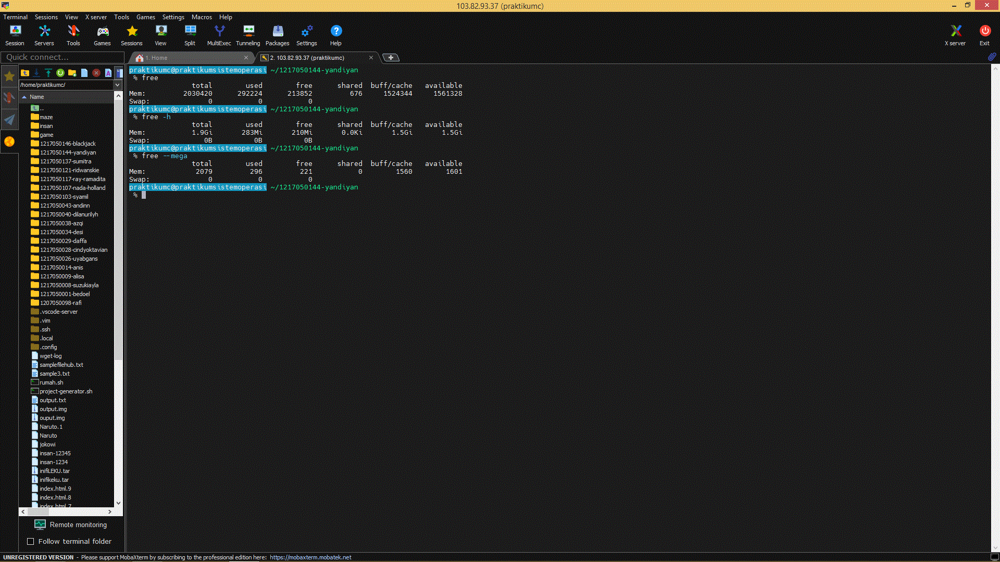
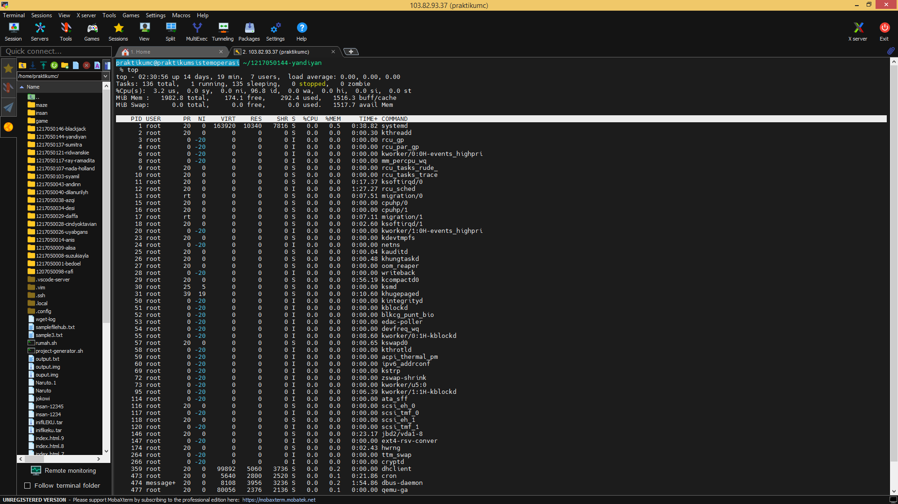
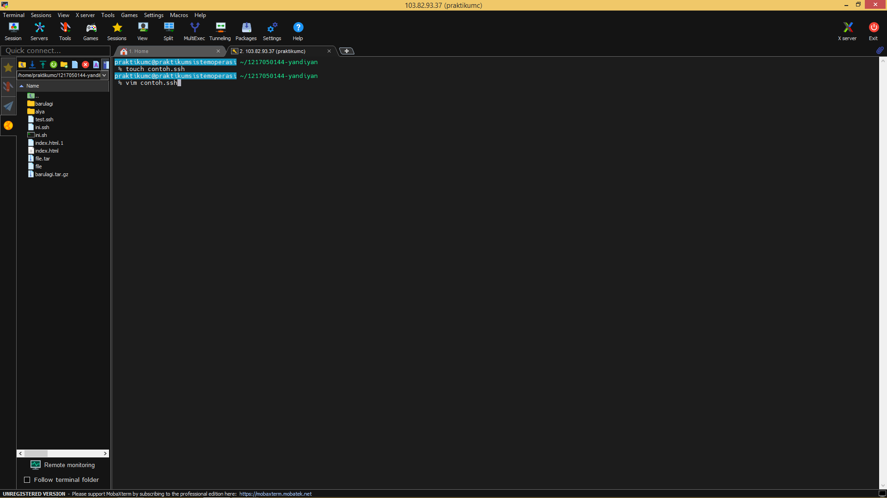
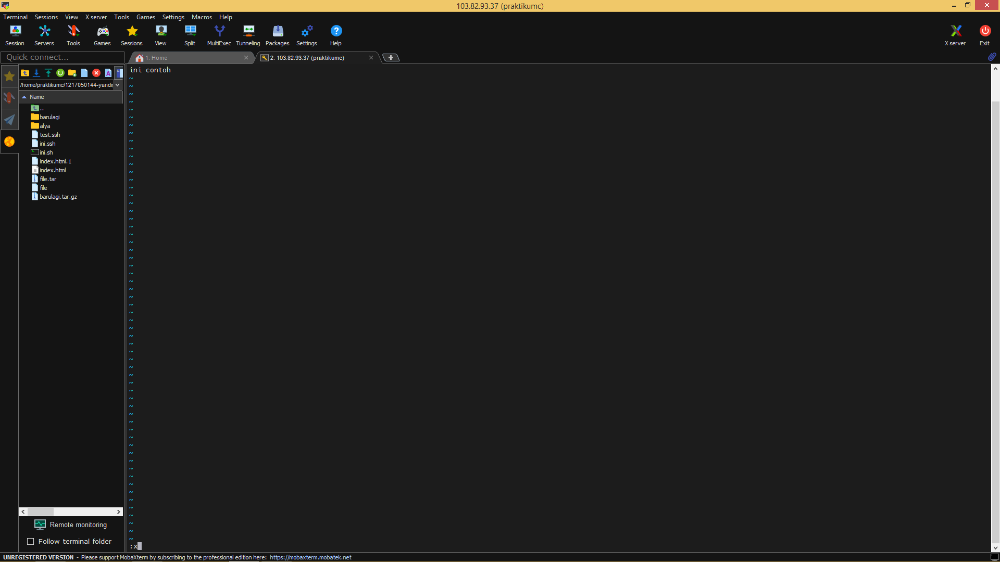
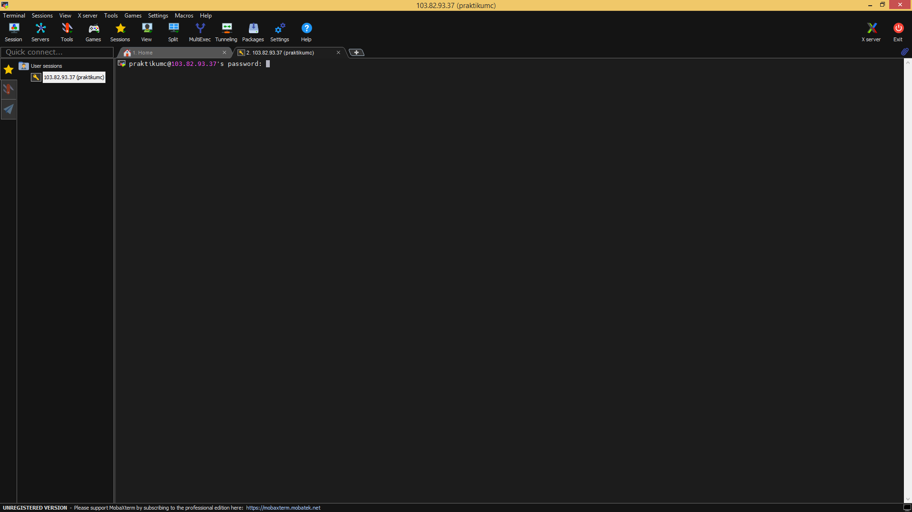

# praktikum.so

## Monitoring Resources dari komputer
Gunakan perintah dibawah untuk memonitoring resource berdasarkan jenis memorinya.

### RAM
```bash
free [options]
```
atau
```bash
 free -h
 free --mega
```



### CPU
```bash
top
```

*ctrl-c untuk menghentikan monitoring CPU

atau
```bash
ps -aux
``` 


### Storage
```bash
df -h
```


## Manajemen Program

### Memonitor program yang sedang berjalan
```bash
top
```
atau
```bash
ps -aux
```

### Menghentikan program
Gunakan kombinasi tombol CTRL + C
atau
Perintah 'kill' digunakan untuk menghentikan proses yang sedang berjalan berdasarkan PID nya.
```bash
kill <PID>
```

### Otomasi perintah dengan shell script
Gunakan `mkdir` atau `touch` untuk membuat atau mengotomasi file.

*Membuat file shell script
```bash
touch namafile.sh
```


*Edit file atau folder
```bash
vim namafile.sh
```
*Gunakan tombol 'I' untuk memasuki mode insert


*Membuat file atau folder
```bash
mkdir namafolder
cd namafolder
touch namafile.ssh
```
*Gunakan tombol ESC lalu ':x' untuk menyimpan sekaligus keluar mode edit.

*Mengubah permission dari file tersebut, gunakan perintah berikut

```bash
chmod XXX namafile.sh

XXX = kode permission
```

Setelah permission diubah, file bisa langsung dieksekusi menggunakan perintah
```bash
./namafile.sh
```

## Manajemen Network

### Akses server menggunakan SSH
```bash
ssh <account>@<ip-server>

Lalu masukkan password bila diminta
```
atau, dengan kombinasi port custom

```bash
ssh <account>@<ip-server> -p <port>
```


## Manajemen File dan Folder

### CRUD file dan folder
- `cd` untuk berpindah direktori / folder
- `ls` untuk melihat isi direktori / folder
- `mkdir` untuk membuat folder
- `touch` untuk membuat file
- `nano` atau `vim` untuk mengedit isi file
- `rmdir` untuk menghapus folder
- `rm` untuk menghapus file / folder
- `mv` untuk memindahkan file atau folder
- `cp` untuk menyalin file atau folder


### Manajemen Izin dan Hak Milik File & Folder
```bash
chmod [XXX] <file/folder>
```

```bash
chown [user:group] <file/folder> 
```

### Pencarian File dan Folder
```bash
find [options] [path] [expressions]
## Kompresi Data
*tar
```bash
tar [options] [output] [file or folder]

contoh
tar -cfv output.tar contoh.ssh
```
Ekstrak file yang dikompresi `tar` bisa dengan cara
```bash
tar -xfv output.tar
```

*gzip
```bash
gzip [options] [file]

contoh
gzip -k contoh.ssh
```
Untuk mengekstrak file yang dikompresi `gzip` bisa dengan cara
```bash
gzip -d output.gz
```
